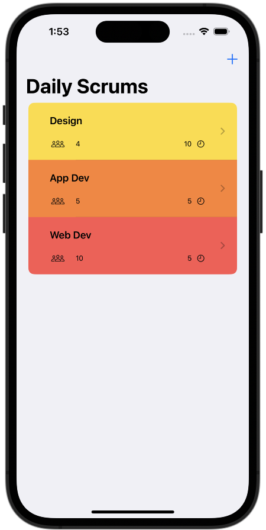

#  Scrumdinger

## Description

This repository contains all the code for the Scrumdinger app. This app was developed as part of the iOS App Dev Tutorials.
The reason for working my way through the tutorial series is to get started with modern apps for iOS.
By finishing this application I was able to learn Swift as well as SwiftUI and get myself familiar with provided features such as "speech to text".

## Author
Marcus Gugacs

## License
See LICENSE as well as the 3RD-PARTY-LICENSES file.
Files provided through the tutorial starter project have a corresponding license notice at the top of the file. 

## Acknowledgments
Some of the files/samples are provided as part of the starter project by Apple Inc.
The tutorial can be found [here](https://developer.apple.com/tutorials/app-dev-training)
